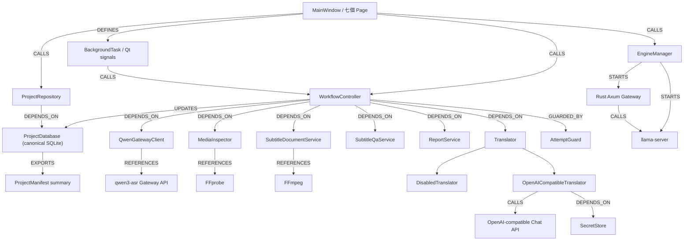

# 聽序 HearFlow Studio — 功能藍圖

> Universal_App_Development_Agent_Template_v1.0、App_Development_Blueprint_Protocol_v2.0、
> Function_and_Class_Knowledge_Graph_with_Hooks_v2.0 已啟用。

## 1. 產品目標

建立一套 Windows 優先、專案式、可批次處理的字幕工作站。介面資訊架構復刻參考圖中的：

- 頂端引擎儀表板
- 專案資料夾列
- 七頁籤工作區
- 專案設定
- 七階段工作流程
- 中央執行控制
- 右側即時日誌

產品名稱改為 **聽序 HearFlow Studio**，不沿用 Hermes 名稱、商標、圖示、額度名詞或
Codex 專屬欄位。

核心 ASR 必須真正整合
[`stevenke1981/qwen3-asr-llama-cpp`](https://github.com/stevenke1981/qwen3-asr-llama-cpp)，
固定記錄整合版本，透過其 OpenAI 相容 Gateway 呼叫 Qwen3-ASR。翻譯另由真實的
OpenAI-compatible Chat Completions provider 執行，可接 OpenAI、Ollama、LM Studio
或其他相容服務；使用者也可選擇不翻譯。

## 2. 已知能力邊界與重要假設

1. 目標系統為 Windows 10/11 x64；主要開發與驗收機有 RTX 3060 Ti 8 GB。
2. 預設模型為 Qwen3-ASR 0.6B Q8_0，預設使用 CUDA 12.4 llama.cpp 發行包；可切換
   CPU、Vulkan、1.7B 或外部 Gateway。
3. 上游 Gateway 為請求完成後一次回傳，並非串流 ASR。
4. 上游 SRT/VTT/verbose JSON 時間戳為 FFmpeg 分片範圍，`timestamp_accuracy=chunk`，
   不是逐字或強制對齊。UI、報告與匯出資訊都必須如實標示。
5. Gateway 沒有工作取消端點。對 App 專屬的本機 managed engine，「強制取消」會終止
   該 generation 的 llama-server 與 Gateway 行程樹後再重啟，確實中止本機推論；
   對外部 Gateway 只能停止等待與後續工作，UI 不得宣稱外部推論已停止。
6. 原始媒體永不修改。所有中間檔、轉錄、校訂版本、翻譯與匯出均放在專案資料夾內。
7. 翻譯 API 金鑰只存 Windows Credential Manager，不寫入專案 manifest、日誌或報告。
8. App 不偽造額度、GPU 使用率、轉錄百分比、說話者分離、逐字時間戳或下載完成狀態。

## 3. 功能規格

### 3.1 首次啟動與引擎

- 自動偵測 Git、FFmpeg、FFprobe、Rust、NVIDIA GPU、llama-server 與 Gateway。
- 「快速安裝本機引擎」可下載官方 llama.cpp Windows 發行包、取得固定版上游原始碼、
  建置 Rust Gateway、產生兩組不同且至少 32 bytes 的本機 API key。
- 可啟動、停止、重啟本機 llama-server 與 Gateway。
- 可使用既有外部 Gateway URL 與 API key。
- 以 `/health/live`、`/health/ready`、`/v1/models` 顯示真實狀態。
- 模型或後端改變時明確要求重啟。

### 3.2 專案管理

- 建立、開啟、最近專案、移出最近清單、在檔案總管開啟。
- SQLite 是工作、字幕、嘗試次數與產物狀態的唯一 canonical source；使用 transaction、
  schema migration、WAL 與 foreign keys。
- `project.json` 只作可攜摘要／匯出，不與 SQLite 形成雙主資料來源。
- 專案目錄至少包含 `media/`、`work/`、`transcripts/`、`subtitles/`、`exports/`、
  `reports/`、`logs/`。
- 可使用既有媒體原路徑，不強制複製大型檔案；manifest 儲存絕對路徑及檔案指紋。
- 每次執行帶 `attempt_id` 與 `generation_id`；晚到的舊回應必須以 compare-and-swap
  拒絕寫回。App 重啟後可恢復檔案狀態與未完成佇列。

### 3.3 媒體掃描與批次

- 支援 WAV、MP3、M4A、MP4、WebM、OGG、Opus、FLAC、AAC、MOV、MKV。
- 可加入單檔、多檔或整個資料夾。
- FFprobe 驗證音訊軌、時長、格式及可讀性。
- 檔名篩選與可選的 `S01E01-S01E12` 集數範圍，不限制一般錄音。
- 可選跳過既有、另存新版本或強制重跑。
- 佇列顯示等待、檢查、轉錄中、翻譯中、已完成、失敗、已取消。

### 3.4 ASR 轉錄

- 呼叫 `POST /v1/audio/transcriptions`，欄位含 file、model、language、prompt、
  response_format=verbose_json、temperature。
- 儲存未修改的原始回應、回應標頭、模型、分片數及執行時間。
- 將 verbose JSON 正規化成可編輯的 `SubtitleSegment`。
- 來源語言支援 `auto` 或 Gateway 回報的語言代碼。
- 錯誤訊息轉成可操作的繁體中文，詳細診斷仍可檢視。

### 3.5 清理、校訂與播放

- 保留原始 ASR 文字，清理版本另存。
- 可做空白、全半形標點、重複空格及空白片段的機械清理。
- 表格可編輯開始、結束、來源文字、翻譯文字與狀態。
- 支援搜尋取代、分割、合併、前後移動與復原最後一次編輯。
- 使用 Qt Multimedia 播放原始媒體，並跳至目前近似分片。
- 人工修改後儲存校訂版本，不覆蓋原始回應。

### 3.6 翻譯

- `DisabledTranslator`：工作狀態明確記為 `skipped`，目標文字為 `NULL`；不得把「原文
  複製到譯文欄」標成翻譯成功。
- `OpenAICompatibleTranslator`：呼叫 `/v1/chat/completions`，以帶 id 的 JSON 批次
  翻譯；驗證回傳 id 完整、無多段遺失、輸出數量一致。
- 支援 base URL、model、temperature、批次大小、來源/目標語言、風格、系統提示。
- 內建台灣繁體中文、美劇口語、正式、逐字等可編輯預設。
- 失敗批次可重試；已成功片段不因單批失敗被覆寫。
- API key 僅透過 `SecretStore` 讀寫 Windows Credential Manager。

### 3.7 字幕 QA、匯出與壓製

- QA 檢查：空白、負時長、重疊、時間倒退、過長行、過高字元/秒、缺少翻譯。
- 匯出 TXT、JSON、verbose JSON、SRT、VTT、ASS，UTF-8 無 BOM。
- ASS 可設定字型、字級、前景色、外框色、陰影、邊界及對齊。
- 以 FFmpeg 將 ASS 壓入 MP4；輸出到新檔，不覆蓋原始影音。
- 匯出後重新解析字幕並驗證時間遞增、檔案非空及編碼。
- 產生 Markdown 與 JSON 工作報告，清楚註明分片級時間戳。

### 3.8 介面頁籤

1. **工作流程**：專案設定、七階段狀態、執行控制、即時日誌。
2. **轉錄佇列**：所有媒體工作、狀態、重試、取消排隊。
3. **文字校訂**：來源與翻譯文字編輯、搜尋取代、播放。
4. **字幕時間軸**：時間、分割、合併、QA；醒目標示「分片級近似時間」。
5. **詞彙與翻譯**：實驗性 ASR prompt、詞彙表、翻譯 provider 與風格。
6. **檔案狀態**：輸入、原始轉錄、校訂、字幕、壓製檔的真實存在狀態。
7. **報告與匯出**：格式選擇、ASS 樣式、壓製、驗證、報告。

## 4. 技術選型

### 4.1 採用

- Python 3.12
- PySide6（Windows 原生桌面 UI、表格模型、執行緒、Qt Multimedia）
- httpx（Gateway 與翻譯 HTTP）
- keyring（Windows Credential Manager）
- FFmpeg / FFprobe
- PyInstaller one-folder 發行
- pytest、pytest-qt

### 4.2 不採用

- Tkinter：可交付但大型可編輯表格、媒體播放、DPI 與背景工作維護成本較高。
- Tauri/Rust 全棧：適合長期產品，但本次需同時整合既有 Rust Gateway；前端、IPC、
  WebView 與打包面積會放大首版風險。
- 將模型載入 Python：偏離指定上游架構，也會重複實作 llama.cpp 整合。

## 5. 專案結構

```text
HearFlow-Studio/
├─ hearflow/
│  ├─ app.py
│  ├─ domain/
│  │  ├─ models.py
│  │  └─ validation.py
│  ├─ services/
│  │  ├─ settings.py
│  │  ├─ database.py
│  │  ├─ project_store.py
│  │  ├─ media.py
│  │  ├─ engine.py
│  │  ├─ gateway.py
│  │  ├─ translation.py
│  │  ├─ subtitles.py
│  │  ├─ workflow.py
│  │  └─ reporting.py
│  └─ ui/
│     ├─ main_window.py
│     ├─ pages.py
│     ├─ table_models.py
│     ├─ dialogs.py
│     └─ theme.qss
├─ scripts/
│  ├─ install-engine.ps1
│  ├─ run.ps1
│  ├─ build.ps1
│  └─ verify.ps1
├─ third_party/
│  └─ qwen3-asr-llama-cpp/
├─ tests/
├─ docs/
├─ pyproject.toml
├─ requirements.txt
├─ README.md
├─ THIRD_PARTY_NOTICES.md
└─ LICENSE
```

`runtime/`、模型、`.env`、媒體、逐字稿與使用者專案不得納入原始碼發行或 Git。

## 6. 類別與函式清單

| 節點 | 狀態 | 單一責任 | 主要輸入 → 輸出 | 依賴 |
|---|---|---|---|---|
| `AppSettings` | 新增 | 全域非秘密設定 | JSON/QSettings → typed settings | dataclasses |
| `ProjectManifest` | 新增 | 專案摘要與可攜匯出 | 專案欄位 → summary | `MediaJob` |
| `MediaJob` | 新增 | 單一媒體工作狀態 | path/options → status/artifacts | `SubtitleSegment` |
| `SubtitleSegment` | 新增 | 可編輯字幕片段 | start/end/text → segment | validation |
| `EngineStatus` | 新增 | 真實引擎狀態 | health/models/process → status | gateway/process |
| `SecretStore` | 新增 | 安全保存翻譯金鑰 | service/key ↔ Credential Manager | keyring |
| `SettingsRepository` | 新增 | 載入/保存全域設定 | settings ↔ QSettings | `SecretStore` |
| `ProjectDatabase` | 新增 | canonical transaction/migration | SQL ↔ typed rows | sqlite3 |
| `ProjectRepository` | 新增 | 專案 use-case 與摘要匯出 | folder/entities ↔ SQLite/JSON | `ProjectDatabase` |
| `MediaInspector` | 新增 | FFprobe 驗證媒體 | media path → metadata | FFprobe |
| `MediaPlayerController` | 新增 | 播放與定位媒體 | media/time → playback state | Qt Multimedia |
| `EngineInstaller` | 新增 | 一鍵安裝核心 | backend/model → runtime | PowerShell/Git/Cargo |
| `EngineManager` | 新增 | 管理兩個本機行程 | config → process/status | QProcess |
| `QwenGatewayClient` | 新增 | 呼叫指定 Gateway | media/options → ASR result | httpx |
| `Translator` | 新增介面 | 翻譯抽象 | segments/options → translations | ABC |
| `DisabledTranslator` | 新增 | 無翻譯模式 | segments → unchanged/empty | `Translator` |
| `OpenAICompatibleTranslator` | 新增 | 真實批次翻譯 | segments/config → translated segments | httpx/SecretStore |
| `SubtitleDocumentService` | 新增 | 清理、解析、編輯與格式輸出 | segments/options → documents | stdlib |
| `SubtitleQaService` | 新增 | 檢測字幕問題 | segments/rules → QA issues | validation |
| `WorkflowController` | 新增 | 七階段佇列協調 | project/jobs → events/state | all services |
| `ReportService` | 新增 | 產生驗收報告 | project/jobs/issues → md/json | project store |
| `BackgroundTask` | 新增 | 非阻塞執行可取消工作 | callable/token → signals | QThreadPool |
| `AttemptGuard` | 新增 | 拒絕舊 generation 寫回 | attempt/generation → CAS result | `ProjectDatabase` |
| `MainWindow` | 新增 | 應用程式外殼 | services → pages/actions | PySide6 |
| `WorkflowPage` | 新增 | 仿圖主工作區 | project/status/events → UI | controller |
| `QueuePage` | 新增 | 批次工作表 | jobs → table/actions | table model |
| `ReviewPage` | 新增 | 校訂與播放 | segments/media → edits | document/player |
| `TimelinePage` | 新增 | 時間調整與 QA | segments → timeline edits | QA service |
| `TranslationPage` | 新增 | 詞彙/翻譯設定 | config/glossary → settings | translator |
| `FilesPage` | 新增 | 顯示真實產物 | job artifacts → status | filesystem |
| `ExportPage` | 新增 | 匯出/壓製/報告 | formats/style → outputs | subtitle/report |
| 上游 Gateway API | 既有參照 | ASR HTTP 邊界 | multipart → JSON/SRT/VTT | qwen3-asr repo |
| FFmpeg/FFprobe CLI | 既有參照 | 媒體探測/壓製 | command args → process output | FFmpeg |
| OpenAI Chat API | 既有參照 | 翻譯 HTTP 邊界 | JSON → JSON | provider |

## 7. 主要方法規格

以下每項至少涵蓋正常、邊界與例外案例；實作後須逐項建立單元測試。

### `ProjectRepository.create(folder, name, settings) -> ProjectManifest`

- 目的：建立不覆蓋既有資料的專案骨架。
- 驗證：名稱非空；資料夾可寫；既有 manifest 不得無提示覆蓋。
- 例外：權限不足、無效 JSON、schema 太新。
- 測試：一般 ASCII 路徑；繁中與空白路徑；既有專案拒絕；唯讀資料夾。

### `ProjectDatabase.transaction() -> ContextManager`

- 目的：讓 job、segments、artifacts 與 event log 以單一 transaction 成功或回滾。
- 例外：constraint、磁碟錯誤、busy timeout；不得留下半完成工作。
- 測試：一般 commit；例外 rollback；foreign key；WAL 重開；migration。

### `ProjectRepository.export_summary(project_id) -> Path`

- 目的：由 SQLite 產生可攜 `project.json` 摘要，永不反向成為第二主資料。
- 例外：專案不存在、磁碟錯誤。
- 測試：一般匯出；Unicode；無 job；secret 不出現在摘要。

### `MediaInspector.probe(path) -> MediaMetadata`

- 目的：呼叫 FFprobe 並確認至少一條音訊軌。
- 驗證：允許副檔名、檔案存在、非空。
- 例外：找不到 FFprobe、逾時、無音訊、格式損壞。
- 測試：WAV；含音訊 MP4；中文路徑；無音訊 MP4；零位元檔。

### `EngineInstaller.install(config, progress, cancel) -> InstallResult`

- 目的：固定上游 commit、下載相符 llama.cpp 發行包、建置 Gateway、建立 `.env`。
- 驗證：磁碟空間、SHA/下載完整性、兩組 key 不同且長度足夠。
- 例外：離線、Git/Cargo 缺失、發行包資產不存在、取消。
- 測試：資產選擇；CPU/CUDA/Vulkan；部分下載復原；重跑冪等；取消清理。

### `EngineManager.start() -> None`

- 目的：依序啟動 llama-server、等待模型，再啟動 Gateway。
- 驗證：埠未占用、二進位存在、設定完整。
- 例外：行程立即退出、ready 逾時、key 無效。
- 測試：正常啟動；已啟動冪等；埠衝突；模型載入失敗。

### `EngineManager.stop() -> None`

- 目的：只停止由本 App 啟動的兩個行程。
- 例外：外部 Gateway 不得被終止；行程逾時後可強制結束但需記錄。
- 測試：正常停止；其中一個已退出；外部模式；逾時。

### `EngineManager.cancel_generation(generation_id) -> CancelResult`

- 目的：managed engine 終止整個專屬行程樹並增加 generation；external mode 只停止等待。
- 驗證：只終止由本 App 建立且 generation 相符的 PID/Job Object。
- 例外：行程已退出視為冪等成功；不得誤殺外部服務。
- 測試：managed 真終止；external 不終止；舊 generation；重啟後 ready；雙次取消。

### `QwenGatewayClient.health() -> EngineStatus`

- 目的：合併 live、ready、models 與 HTTP 錯誤為真實狀態。
- 例外：連線拒絕、401、503、非 JSON。
- 測試：ready；loading；offline；wrong key。

### `QwenGatewayClient.transcribe(path, options) -> AsrResult`

- 目的：以 multipart 呼叫上游，保存 headers 與 verbose JSON。
- 驗證：temperature 0..1、prompt <=4096 bytes、檔案存在。
- 例外：400/401/408/413/429/502、逾時、無效回應。
- 測試：單片；多片；中文；錯誤 key；取消等待；response 缺欄位。

### `OpenAICompatibleTranslator.translate(segments, config) -> list[Translation]`

- 目的：以 id 固定映射的 JSON 批次翻譯。
- 驗證：base URL、model、批次大小、目標語言、API key 規則。
- 例外：401/429/5xx、JSON 被 code fence 包裹、缺 id、重複 id、超時。
- 測試：正常 JSON；Ollama 無 key；重試；缺片段拒絕；保留標記與換行。

### `SubtitleDocumentService.clean(segments, rules) -> list[SubtitleSegment]`

- 目的：建立清理副本，不修改 raw ASR。
- 例外：非法時間保持並交由 QA 報告，不靜默吞掉。
- 測試：中文標點；英文空白；空片段；Unicode；輸入不變性。

### `SubtitleDocumentService.split(segment_id, at_ms) -> tuple[Segment, Segment]`

- 目的：在合法時間內分割，文字使用游標或近似二分。
- 驗證：切點嚴格位於 start/end 內。
- 例外：片段不存在、切點越界、時長過短。
- 測試：一般分割；中文字；邊界拒絕；空文字。

### `SubtitleDocumentService.merge(ids) -> SubtitleSegment`

- 目的：合併連續片段並保留最早開始與最晚結束。
- 驗證：至少兩段且在文件中連續。
- 例外：非連續、找不到 id。
- 測試：兩段；多段；中文不插錯誤空白；非連續拒絕。

### `SubtitleDocumentService.export(format, segments, options) -> Path`

- 目的：從校訂版輸出 TXT/JSON/verbose JSON/SRT/VTT/ASS。
- 驗證：格式白名單、輸出不覆蓋原媒體、UTF-8 無 BOM。
- 例外：QA 阻擋級錯誤、磁碟失敗、無片段。
- 測試：六格式；Unicode；行換行；時間格式；既有檔版本化。

### `SubtitleQaService.inspect(segments, rules) -> list[QaIssue]`

- 目的：回報而非靜默修正時間與可讀性問題。
- 測試：正常；重疊；倒退；空白；CPS 過高；長行；缺翻譯。

### `WorkflowController.enqueue(paths, options) -> list[MediaJob]`

- 目的：去重、保存並加入單工佇列。
- 例外：無效媒體個別失敗，不阻斷其餘檔案。
- 測試：單檔；三檔；重複；重啟恢復；skip/force/versioned。

### `WorkflowController.run_next() -> None`

- 目的：依檢查、轉錄、清理、翻譯、QA、匯出推進狀態。
- 例外：每階段原子保存；失敗保留可重試點；不得標記假完成。
- 測試：完整成功；ASR 失敗；翻譯部分失敗；取消排隊；重新啟動續跑。

### `AttemptGuard.commit_if_current(attempt_id, generation_id, mutation) -> bool`

- 目的：只有目前 active attempt/generation 能將回應寫入 canonical SQLite。
- 例外：舊回應回傳 false 且記錄 suppressed event，不修改成果。
- 測試：current 成功；取消後舊回應被拒；重試覆蓋；跨重啟 generation。

### `ReportService.generate(project) -> tuple[Path, Path]`

- 目的：輸出 Markdown 與 JSON 的可追查結果。
- 驗證：遮蔽金鑰；不嵌入完整原始音訊或 base64。
- 測試：成功批次；混合失敗；無工作；Unicode；秘密遮蔽。

## 8. 知識圖譜



## 9. Hooks

- `pre_blueprint_hook`：掃描工作區與上游 API，確認新專案無既有實作可覆蓋。
- `on_reference_detected_hook`：將 Gateway、FFmpeg、OpenAI-compatible API 合約記錄在
  `docs/REFERENCE_CONTRACTS.md`。
- `on_class_added_hook`：每新增類別即補 inventory、型別與責任。
- `on_method_added_hook`：每新增 public 方法即加入相對應測試。
- `pre_implementation_hook`：在寫入產品碼前由獨立 reviewer 審核本藍圖。
- `post_update_hook`：執行測試並比對此文件與實際模組。
- `visualization_hook`：完成後以 AST 重新產生最終類別/函式圖。

## 10. 藍圖審查門檻

審查者必須檢查：

- 是否真的整合指定上游，不以 mock 取代正式路徑。
- 圖片中的專案、七頁籤、三欄工作區、日誌與工作流是否有對應。
- 所有按鈕是否有真實狀態變更或明確 disabled 原因。
- 模型安裝、ASR、翻譯、校訂、匯出、壓製與恢復是否形成完整旅程。
- 時間戳、取消、串流與 GPU 能力是否誠實。
- 秘密、原始影音與使用者資料是否安全。
- Windows DPI、繁體中文、空白/Unicode 路徑與背景執行是否納入。

只有 reviewer 回覆 `APPROVE`，或 `REVISE` 項目全部整合後，才進入參照展開與實作。

### 審查紀錄

- 第一輪：`REVISE`
  - 要求執行中取消具備真實語意。
  - 要求消除 JSON/SQLite 雙主資料風險。
  - 要求 no-translation 不得被算成翻譯成功。
  - 要求非同步晚到結果以 attempt/generation CAS 阻擋。
  - 要求發行物封閉第三方執行依賴與授權，並加入乾淨 Windows CPU gate。
- 第二輪：`APPROVE`
  - 已整合上述修訂；實作必須維持 managed/external engine 取消語意差異。

## 11. 驗收門檻

- 單元測試與整合測試通過。
- upstream Gateway 套件驗證與 Rust 測試通過。
- 正式 Qt App 可啟動，視窗有 HWND、正確標題且不立即退出。
- 使用官方中文樣本跑完本機 CUDA 轉錄，取得 HTTP 200 與非空文字。
- 建立含繁中與空白的專案，編輯字幕後輸出六種格式。
- 使用本機 stub 與至少一個真實 OpenAI-compatible endpoint 驗證翻譯 provider；
  無可用憑證時只可將外部 provider 實測標記為受限，不可偽稱通過。
- FFmpeg 壓製輸出能被 FFprobe 讀取，原始媒體雜湊不變。
- PyInstaller 產物啟動成功，並提供可直接執行的 EXE 與壓縮包。
- 另在沒有開發環境變數與既有快取假設的乾淨 Windows CPU 路徑驗證 release
  dependency closure；CUDA 是目標機額外實機 gate，不得取代 CPU fallback。
- 發行包隨附第三方 notices，明確區分 App、上游 Gateway、llama.cpp、Qwen3-ASR 模型
  與 FFmpeg 的授權與下載責任。
- 由獨立 code reviewer、安全 reviewer 與 UI/runtime 驗收者檢查後修正。
