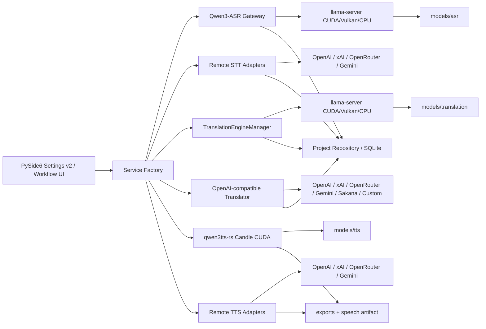

# HearFlow Studio 架構稽核與改善說明

## 原始架構

原專案已具備良好的基礎：Python 3.12、PySide6、專案型 SQLite 儲存、Qwen3-ASR Gateway、llama.cpp lifecycle、字幕清理／QA／輸出，以及 OpenAI-compatible 翻譯抽象。主要問題不在於缺少骨架，而是本機模型隔離、服務建構與供應商能力邊界尚未完整。

## 已修正的高風險問題

### 1. ASR 可能誤載翻譯 GGUF

原本 `EngineManager.resolve_paths()` 直接取 `runtime/models/*.gguf` 中第一個非 mmproj 檔案。安裝 Gemma 翻譯模型後，排序結果可能使 ASR llama-server 載入錯誤模型。

改善：

- 新目錄分成 `models/asr`、`models/translation`、`models/tts`。
- 舊版 fallback 只接受名稱明確包含 ASR 的 GGUF。
- 明確排除 Gemma／translation 名稱。

### 2. 本機翻譯可能啟動成功但回傳 401

TranslationEngineManager 啟動 llama-server 時會產生一把內部 API key；原翻譯 client 卻從 Credential Manager 依 provider 名稱讀取另一把 key，兩者不一致。

改善：

- `OpenAICompatibleTranslator` 支援明確注入 session API key。
- service factory 將同一個 TranslationEngineManager.api_key 傳入 translator。
- 本機 key 只存在記憶體，不寫入一般設定。

### 3. CPU 翻譯重複傳入 `--n-gpu-layers`

原啟動參數先使用設定值，再在 CPU 模式追加 `--n-gpu-layers 0`。重複 flag 的解析行為依版本而異。

改善：先計算唯一 `gpu_layers` 值，再只產生一次參數。

## 已修正的功能與資料品質問題

### 能力與供應商分離

新增 capability catalog。供應商不會因為支援文字 API 就被誤列成 STT/TTS：

- Sakana Fugu：翻譯／文字 only。
- OpenAI、xAI、OpenRouter、Gemini：依各自 request protocol 建立 adapter。
- 自訂 OpenAI 相容服務：由使用者自行提供 URL 與模型。

### 時間軸誠實標示

遠端 API 只回傳整篇文字時，舊式做法容易生成極短或不可信的單段時間軸。新版會：

- 優先使用 provider segments。
- 其次把 word timestamp 分組成字幕片段並保留 speaker。
- 都沒有時，依實際媒體長度與標點分段。
- 估算時間一律標記 `estimated`，不宣稱是原生逐字時間。

### 設定解耦

schema v2 把 STT、translation、TTS 分成獨立設定與 Credential ID。v1 設定會自動遷移；舊 provider `default` 會轉成 `custom-openai`，同時保留原 credential 查詢名稱。

### TTS 工作流程

新增：

- 本機 Qwen3-TTS CLI adapter。
- 遠端 TTS adapters。
- 長逐字稿切段與 FFmpeg 串接。
- `speech` artifact。
- 桌面 UI 產生語音按鈕。
- 可安全取消，且不把已完成的轉錄工作誤標成 cancelled。

## 新架構

## 仍應列入後續版本的項目

1. 遠端大檔自動切段、平行上傳與 retry/resume。
2. 麥克風即時串流與 partial transcript。
3. 真正 speaker diarization 的統一資料模型。
4. 依字幕時長做 dubbing time-stretch／對嘴對齊。
5. 多 GPU／VRAM scheduler，避免 ASR、翻譯與 TTS 同時搶滿顯存。
6. provider model discovery 與伺服器端 capability probe。
7. Windows CI runner 上的 CUDA smoke test 與 GUI automation。
